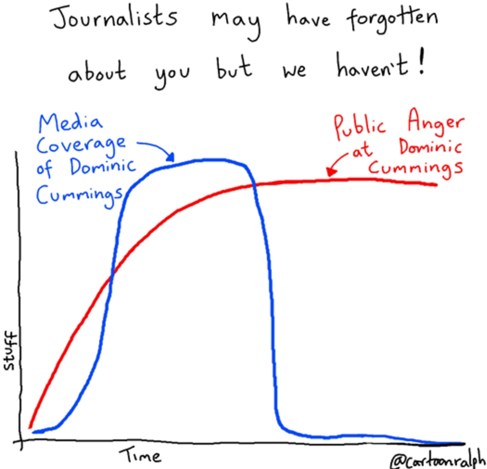

# Covid19
Covid data science

* Influenza pandemic 1918

* Uk data showing the begining of a second wave 

data source https://coronavirus-staging.data.gov.uk/

Below are examples of problematic countries

* Iran currently showing a second wave

* Israel currently showing a second wave

* Australia currently showing a second wave

* Spain new cases just begining to tick up

* America, not sure if this is a second wave or an extension of the first wave

* Brasil is still on its first wave

data source from https://covid19.who.int/WHO-COVID-19-global-data.csv

* Public anger towards UK prime ministers top aid Dominic Cummings 

